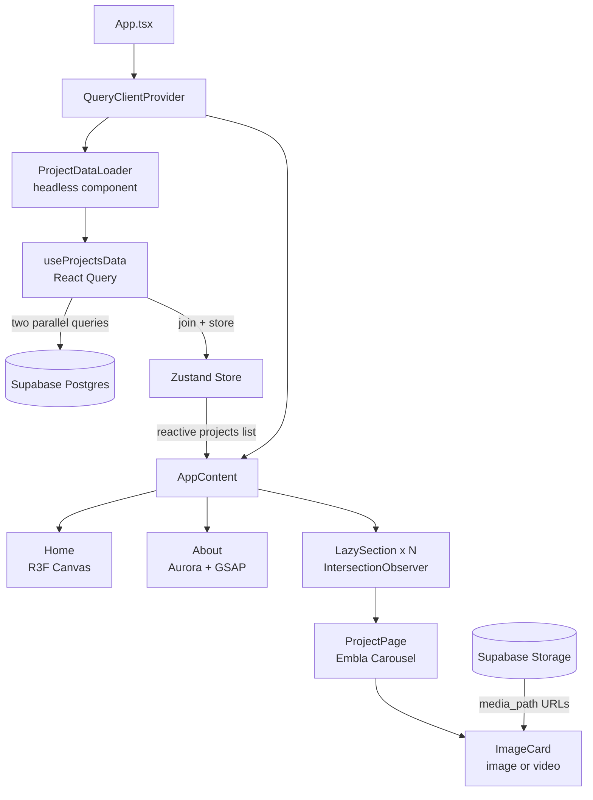
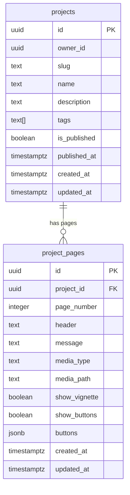
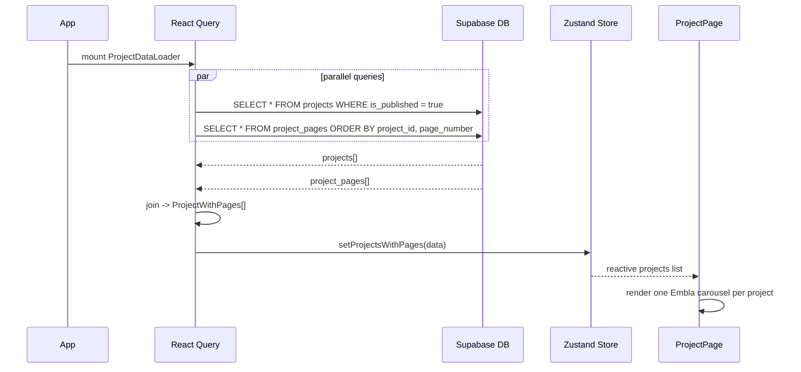
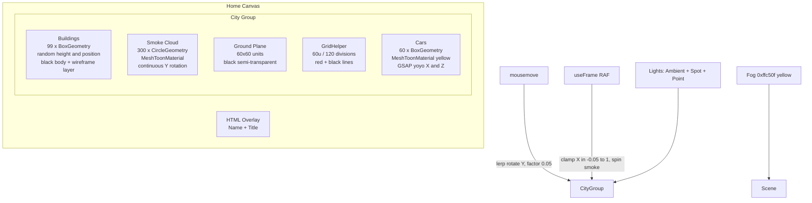

# threejs-portfolio

> A fully dynamic, CMS-driven developer portfolio with an interactive 3D Matrix city background, immersive project showcases, and a Supabase backend — ready to fork and make your own.


---

## What Is This?

`threejs-portfolio` is an open-source developer portfolio template you can fork, connect to your own Supabase project, and populate with your own projects — no code changes needed for content.

- The **Home** page features a procedurally animated Matrix-style 3D city rendered in WebGL as a fullscreen background.
- The **About** section uses an OGL-powered Aurora shader and GSAP cursor effects.
- **Projects** are fetched from Supabase at runtime and rendered as fullscreen carousel sections, each with multiple slides, media (images or videos), and call-to-action buttons — all managed from your database.

No hardcoded project data lives in the frontend. Add, remove, or reorder projects by updating rows in Supabase.

---

## Table of Contents

- [Demo Sections](#demo-sections)
- [Architecture Overview](#architecture-overview)
- [Tech Stack](#tech-stack)
- [Project Structure](#project-structure)
- [How Projects Work](#how-projects-work)
  - [Database Schema](#database-schema)
  - [Example Data](#example-data)
  - [Data Flow](#data-flow)
- [The 3D Background](#the-3d-background)
- [Getting Started](#getting-started)
- [Environment Variables](#environment-variables)
- [Supabase Setup](#supabase-setup)
- [Scripts](#scripts)
- [Performance Design](#performance-design)
- [Contributing](#contributing)

---

## Demo Sections

The portfolio is a single scrollable page with three sections rendered in order:

| Section      | What It Does                                                                                                            |
| ------------ | ----------------------------------------------------------------------------------------------------------------------- |
| **Home**     | Full-screen WebGL canvas with a Matrix-style animated 3D city in the background and your name/title overlaid            |
| **About**    | Dark section with Aurora WebGL gradient, GSAP cursor-follow developer images, and your bio                              |
| **Projects** | One full-screen section per project, each lazy-mounted and containing an Embla carousel with slides, media, and buttons |

---

## Architecture Overview



---

## Tech Stack

| Category      | Library                    | Version | Role                                    |
| ------------- | -------------------------- | ------- | --------------------------------------- |
| Framework     | React                      | 19      | UI                                      |
| Language      | TypeScript                 | ~5.9    | Strict typing throughout                |
| 3D Engine     | Three.js                   | ^0.182  | 3D scene geometry and rendering         |
| 3D Bindings   | @react-three/fiber         | ^9.5    | React reconciler for Three.js           |
| 3D Helpers    | @react-three/drei          | ^10.7   | `<Html>` overlay inside canvas          |
| Animation     | GSAP + @gsap/react         | ^3.14   | City cars, text effects, cursor         |
| Animation     | motion (Framer)            | ^12     | Draggable carousel utility              |
| WebGL Shader  | ogl                        | ^1.0    | Aurora raw GLSL effect (About page)     |
| Backend       | Supabase                   | ^2.100  | Postgres DB + file Storage              |
| Data Fetching | TanStack React Query       | ^5.95   | Parallel queries with caching           |
| Global State  | Zustand                    | ^5.0    | Holds fetched `ProjectWithPages[]`      |
| Carousel      | Embla Carousel             | ^8.6    | Project slide navigation                |
| UI            | Ant Design                 | ^6.2    | Buttons                                 |
| Icons         | react-icons + lucide-react | latest  | Icon resolution for slide buttons       |
| CSS           | TailwindCSS                | ^4      | Utility classes                         |
| Build         | rolldown-vite              | ^7.2    | Rust-based Vite bundler (faster builds) |

---

## Project Structure

```
src/
├── App.tsx                     # Root — QueryClient, lazy sections, page order
├── components/
│   ├── Aurora.tsx              # OGL raw WebGL simplex-noise gradient shader
│   ├── Carousel.tsx            # Framer Motion draggable carousel (utility)
│   ├── ScrollReveal.tsx        # Scroll-triggered reveal wrapper
│   ├── TextPressure.tsx        # Variable-weight text animation
│   ├── city/
│   │   └── City.tsx            # Three.js Matrix city background scene
│   ├── custom-hooks/
│   │   ├── useEmblaNavigation.ts    # Prev/next disabled state for Embla
│   │   └── useEmblaSelectedSnap.ts  # Centered slide index from Embla
│   └── custom-text/
│       ├── HoverText.tsx
│       └── animated-svg/
│           ├── AnimatedSvgText.tsx
│           ├── MaskedTextGroup.tsx
│           └── useGsapTextAnim.ts
├── pages/
│   ├── home/
│   │   ├── Home.tsx            # R3F Canvas + HTML name/title overlay
│   │   └── index.css.tsx
│   ├── about/
│   │   ├── About.tsx           # Aurora, GSAP cursor images, bio
│   │   └── index.css.tsx
│   └── project/
│       ├── ProjectPage.tsx     # Embla carousel — one per project
│       ├── ImageCard.tsx       # Single slide: renders image or video
│       ├── EmblaCarouselDotButton.tsx
│       ├── index.css.tsx
│       └── core/
│           └── projects.json   # Local seed data (legacy fallback)
├── hooks/
│   └── useProjectsData.ts      # React Query: fetch projects + pages, join, store
├── store/
│   └── projectStore.ts         # Zustand: ProjectWithPages[] global state
├── lib/
│   ├── supabaseClient.ts       # Supabase client singleton (reads .env)
│   └── utils.ts
└── utils/
    ├── interfaces.ts           # All global TypeScript interfaces
    ├── constants.ts
    ├── dataLoader.ts           # Local JSON loader (legacy)
    ├── horizontalLoop.ts       # GSAP horizontal loop helper
    └── iconMapper.tsx          # Maps icon key strings to React icon components
```

---

## How Projects Work

All portfolio content is stored in two Supabase tables: `projects` and `project_pages`. The frontend fetches both in parallel, joins them client-side, and renders one full-screen carousel section per published project.

### Database Schema



**`media_path`** is a public Supabase Storage URL to an image or video file. The `ImageCard` component auto-detects the file type and renders either `` or `<video>` accordingly.

**`buttons`** is a JSONB array of `ProjectButton` objects rendered on the first slide of each project:

```typescript
interface ProjectButton {
  text: string;
  icon: string; // key resolved via iconMapper.tsx (e.g. "play-circle")
  isPrimary: boolean;
  buttonType: 'navigation' | 'link';
  url?: string; // for external links
  navigationPath?: string; // for in-app navigation
  disabled: boolean;
}
```

---

### Example Data

Below is an example of what the Supabase API returns. Your portfolio reads exactly this shape.

**`projects` table:**

```json
[
  {
    "id": "xxxxxxxx-xxxx-xxxx-xxxx-xxxxxxxxxxxx",
    "slug": "my-saas-app",
    "name": "My SaaS App",
    "description": "A multi-tenant platform for managing teams and subscriptions.",
    "tags": ["React", "TypeScript", "Node.js", "PostgreSQL"],
    "is_published": true
  },
  {
    "id": "yyyyyyyy-yyyy-yyyy-yyyy-yyyyyyyyyyyy",
    "slug": "mobile-app",
    "name": "Mobile App",
    "description": "A cross-platform mobile app with offline support and push notifications.",
    "tags": ["React Native", "Expo", "Firebase", "Mobile"],
    "is_published": true
  },
  {
    "id": "zzzzzzzz-zzzz-zzzz-zzzz-zzzzzzzzzzzz",
    "slug": "design-tool",
    "name": "Design Tool",
    "description": "A browser-based design tool with real-time collaboration.",
    "tags": ["WebGL", "Canvas API", "WebSockets", "React"],
    "is_published": false
  }
]
```

**`project_pages` table — example slides for `my-saas-app`:**

```json
[
  {
    "project_id": "xxxxxxxx-xxxx-xxxx-xxxx-xxxxxxxxxxxx",
    "page_number": 1,
    "header": "Your Slide Headline",
    "message": "A short description of what this slide is about.",
    "media_type": "video",
    "media_path": "https://your-project.supabase.co/storage/v1/object/public/assets/my-saas-app/intro.mp4",
    "show_vignette": true,
    "show_buttons": true,
    "buttons": [
      {
        "text": "Live Demo",
        "icon": "play-circle",
        "isPrimary": true,
        "buttonType": "link",
        "url": "https://your-demo-url.com",
        "disabled": false
      },
      {
        "text": "Case Study",
        "icon": "file-text",
        "isPrimary": false,
        "buttonType": "link",
        "url": "https://your-case-study-url.com",
        "disabled": false
      }
    ]
  },
  {
    "project_id": "xxxxxxxx-xxxx-xxxx-xxxx-xxxxxxxxxxxx",
    "page_number": 2,
    "header": "Second Slide Headline",
    "message": "Supporting detail for this feature or screenshot.",
    "media_type": "image",
    "media_path": "https://your-project.supabase.co/storage/v1/object/public/assets/my-saas-app/rbac.webp",
    "show_vignette": true,
    "show_buttons": false,
    "buttons": []
  },
  {
    "project_id": "xxxxxxxx-xxxx-xxxx-xxxx-xxxxxxxxxxxx",
    "page_number": 3,
    "header": "Third Slide Headline",
    "message": "Another line of supporting copy for this slide.",
    "media_type": "image",
    "media_path": "https://your-project.supabase.co/storage/v1/object/public/assets/my-saas-app/scale.webp",
    "show_vignette": true,
    "show_buttons": false,
    "buttons": []
  }
]
```

Each project can have as many pages as you want. `page_number` controls carousel order. Only projects with `is_published: true` are fetched and displayed.

---

### Data Flow



---

## The 3D Background

The `City.tsx` component renders a Matrix-style animated city as the **background** of the Home page only. It lives inside a `@react-three/fiber` `<Canvas>` at 100vw × 100vh with your name and title overlaid using `<Html>` from `@react-three/drei`.



**How it behaves:**

- The city rotates smoothly toward the mouse cursor using a `0.05` lerp factor each frame.
- X rotation is clamped to `[-0.05, 1]` so the city never flips.
- Cars drive back and forth across X and Z using randomised GSAP yoyo timelines.
- Smoke particles spin continuously on the Y axis via `useFrame`.

To personalise the home page, update the name and title strings inside `Home.tsx` — the city itself requires no changes.

---

## Getting Started

```bash
# 1. Fork or clone this repo
git clone https://github.com/your-username/threejs-portfolio.git
cd threejs-portfolio

# 2. Install dependencies
npm install

# 3. Add environment variables
# Create a .env file in the root (see Environment Variables below)

# 4. Set up Supabase tables
# See the Supabase Setup section below

# 5. Start the dev server
npm run dev
```

---

## Environment Variables

Create a `.env` file in the root of the project:

```env
VITE_SUPABASE_URL=https://your-project-id.supabase.co
VITE_SUPABASE_API_KEY=your-supabase-anon-public-key
```

| Variable                | Where to find it                                                  |
| ----------------------- | ----------------------------------------------------------------- |
| `VITE_SUPABASE_URL`     | Supabase dashboard → Project Settings → API → Project URL         |
| `VITE_SUPABASE_API_KEY` | Supabase dashboard → Project Settings → API → `anon` `public` key |

> Never commit `.env`. It is gitignored. Only the anon/public key is used — this is safe to expose in the browser per Supabase's RLS model.

---

## Supabase Setup

### 1. Create the tables

Run this SQL in your Supabase SQL editor:

```sql
-- Projects table
create table projects (
  id            uuid primary key default gen_random_uuid(),
  owner_id      uuid,
  slug          text not null,
  name          text not null,
  description   text,
  tags          text[] default '{}',
  is_published  boolean default false,
  published_at  timestamptz,
  created_at    timestamptz default now(),
  updated_at    timestamptz default now()
);

-- Project pages table
create table project_pages (
  id            uuid primary key default gen_random_uuid(),
  project_id    uuid references projects(id) on delete cascade,
  page_number   integer not null,
  header        text not null,
  message       text,
  media_type    text,        -- 'image' or 'video'
  media_path    text,        -- full public Supabase Storage URL
  show_vignette boolean default true,
  show_buttons  boolean default false,
  buttons       jsonb default '[]',
  created_at    timestamptz default now(),
  updated_at    timestamptz default now()
);
```

### 2. Enable Row Level Security (recommended)

```sql
alter table projects enable row level security;
alter table project_pages enable row level security;

-- Allow anyone to read published projects
create policy "Public read projects"
  on projects for select
  using (is_published = true);

create policy "Public read project_pages"
  on project_pages for select
  using (true);
```

### 3. Create a Storage bucket

In Supabase Storage, create a public bucket named `assets`. Upload your project media (images and videos) and use the public URL as `media_path` in your `project_pages` rows.

### 4. Add your projects

Insert rows into `projects` and `project_pages`. Set `is_published = true` to make them appear. Use `page_number` to control slide order within each project.

---

## Scripts

| Script    | Command                | Description                                |
| --------- | ---------------------- | ------------------------------------------ |
| `dev`     | `vite`                 | Start dev server with HMR                  |
| `build`   | `tsc -b && vite build` | Type-check then produce a production build |
| `preview` | `vite preview`         | Serve the production build locally         |
| `lint`    | `eslint .`             | Lint all source files                      |

---

## Performance Design

| Technique                 | Where                | Detail                                                                                                                                                                                                  |
| ------------------------- | -------------------- | ------------------------------------------------------------------------------------------------------------------------------------------------------------------------------------------------------- |
| **Lazy mounting**         | `App.tsx`            | Each project section is wrapped in `LazySection` — an `IntersectionObserver` that only mounts a component when it is within `400px` of the viewport. Nothing beyond the fold exists in the DOM on load. |
| **React Query caching**   | `useProjectsData.ts` | Supabase data is cached client-side. Navigating back does not re-fetch.                                                                                                                                 |
| **Video pause on scroll** | `ProjectPage.tsx`    | `useEmblaSelectedSnap` tracks the currently centred slide index. Off-screen video slides can be paused to prevent background decode overhead.                                                           |
| **Rolldown bundler**      | `package.json`       | Uses `rolldown-vite` (Rust-based) instead of standard Vite for faster production builds.                                                                                                                |
| **Parallel queries**      | `useProjectsData.ts` | `projects` and `project_pages` are fetched simultaneously with two independent `useQuery` calls.                                                                                                        |

---

## Contributing

Contributions are welcome. If you fork this and add a useful feature — a new shader, additional slide types, an admin UI for managing Supabase content, etc. — feel free to open a PR.

1. Fork the repo
2. Create a feature branch: `git checkout -b feature/my-feature`
3. Commit your changes
4. Push and open a Pull Request

Please follow the conventions in [agents.md](agents.md) for code style and component structure.

---

## License

MIT — use it, fork it, make it yours.
